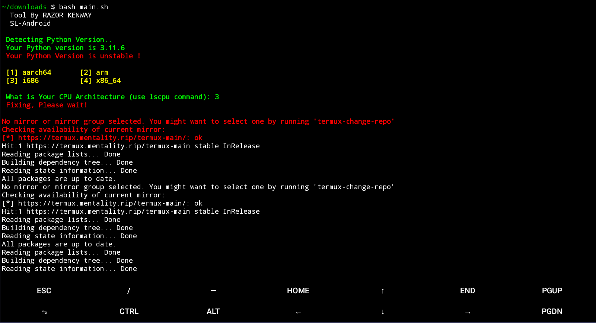

# Python Encoding Error Fixer and Python 3.9.7 Downgrader

## Video Lesson : 

 

 

* Python's latest versions may introduce compatibility issues with older code or packages. With our easy-to-follow instructions and resources, you can safely downgrade your Python environment to version 3.9.7. This version is renowned for its stability and broad package support, making it an ideal choice for projects with specific version requirements.

## INSTALLATION [Termux] [Linux] :

* `apt-get update -y`
* `apt-get upgrade -y`
* `apt install git -y`
* `git clone https://github.com/RazorKenway/Fix.git`
* `cd Fix`
* `bash main.sh`

## INSTRUCTION FOR USERS
    
    (1) First make sure your All packages are updated.
        
    (2) Please on your mobile data or Wi-fi 
    
    (3) Install the All packages provided by the developer correctly.
        
    (4) Then install the requirements provided by the developer.

    (5) Finally Run bash file (main.sh)

         

